<h3 style="color:red;text-align:center">乐之者java: https://www.roadjava.com/ 制作</h3>

<h1 style="color:orange;text-align:center">spring ai</h1>

### 简介

官网: https://spring.io/projects/spring-ai/

本次课程使用的版本: 2.0.0

主要功能: 统一java访问ai模型的api,封装通用能力，保证扩展性

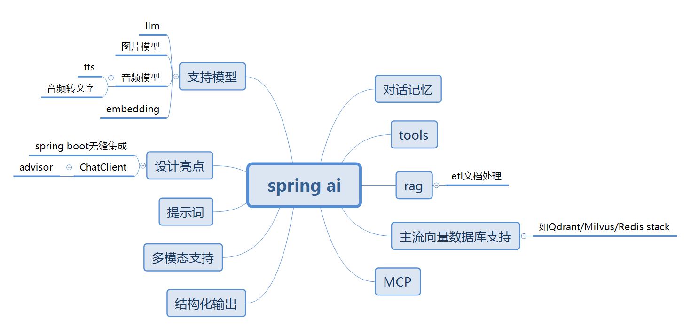

其他框架如:

* spring ai alibaba

* langchain4j

### 模型

#### Chatmodel聊天模型

##### 访问deepseek

##### 访问ollama

##### 如何访问没有内置starter的厂商模型

* 基于open api风格
* 基于anthropic api风格

#### ImageModel图片模型

#### 音频模型

##### TextToSpeechModel文本转语音

tts

##### TranscriptionModel语音转文字

#### EmbeddingModel向量模型

用于生成向量的模型

### ChatClient

#### ChatClient的创建与多个共存

#### 同步调用和流式返回

#### token使用统计

#### advisor

##### 介绍

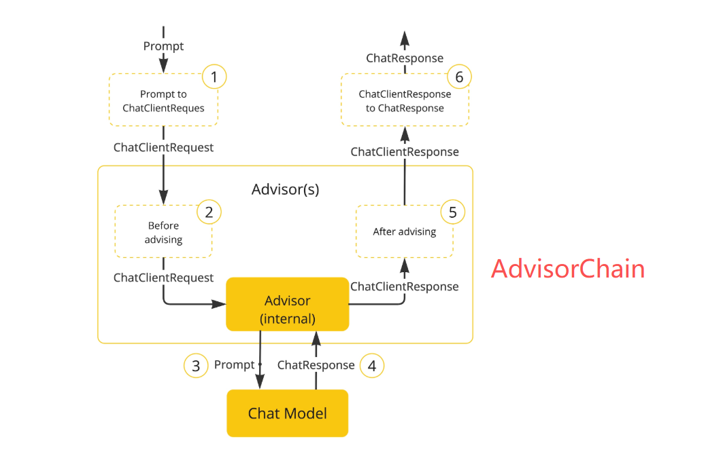

##### 作用

用于拦截、修改和增强 Spring AI与ai模型间交互的请求或响应。

##### 内置实现

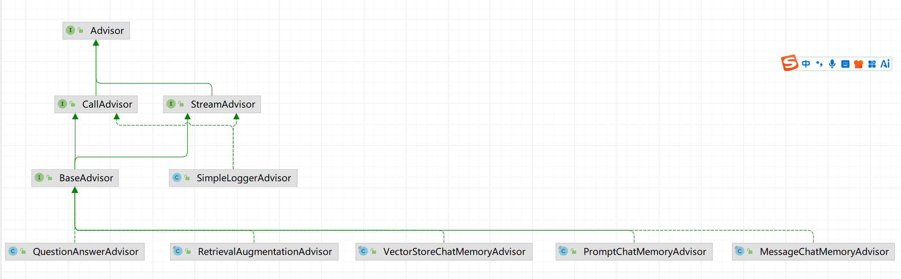

* SimpleLoggerAdvisor

* SafeGuardAdvisor

* MessageChatMemoryAdvisor

* QuestionAnswerAdvisor

* RetrievalAugmentationAdvisor

##### 自定义advisor

实现BaseAdvisor即可

### 提示词

#### 类型

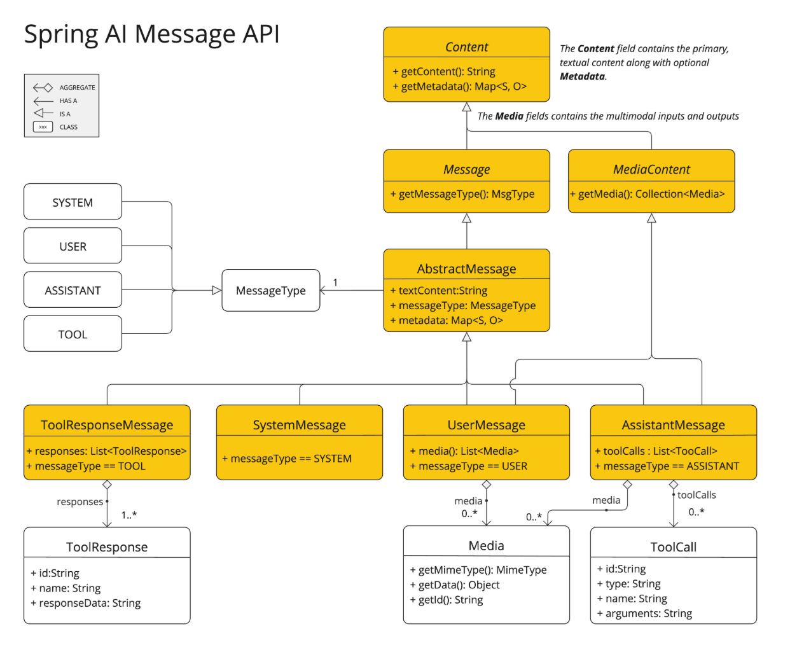

* system:用于引导ai的行为和响应,系统提示词
* user:用户显式输入的
* assistant:ai返回的

#### 模板最佳实践

提示词不是死的,下面只是最佳实践，推荐markdown的格式,结构更清晰,ai更容易理解:

```markdown
# 角色说明
你是xx
# 技能
# 限制
# 示例参考
```

#### PromptTemplate与动态参数

#### 定制提示词模板

### 多模态

### 结构化输出

### 对话记忆

#### 介绍

大模型是无状态,需要携带之前的对话内容(对话上下文)才能让大模型具备记忆的能力。

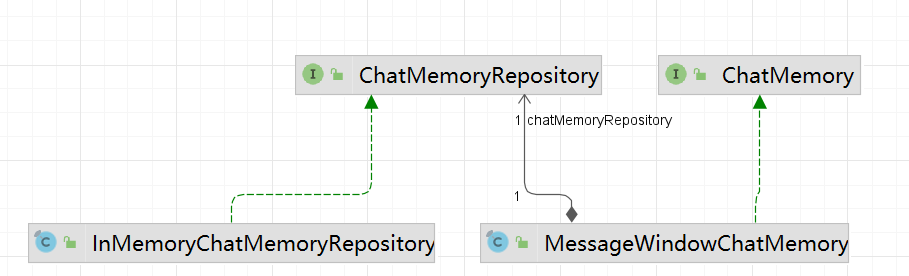

#### 基于内存实现

#### 基于jdbc实现

#### 基于redis实现

### tools

#### 作用

让大模型与业务系统的方法进行连接,完成通过自然语言调用自己系统内业务方法的功能。也称为tool calling 或function-call。

#### 场景

* 智能系统助手/智能应用系统


#### 业务系统准备

#### 通过自然语言完成工具调用

#### 工具调用源码分析

应用拿到mcp声明的tools描述信息(与自己应用里面自己定义的tools一样)发给大模型，大模型解析出要调用的工具和参数，交给应用程序，应用程序通过反射进行调用。

chatClientRequest:

```plain
request: ChatClientRequest[prompt=Prompt{messages=[UserMessage{content='北京的天气怎么样', metadata={messageType=USER}, messageType=USER}], modelOptions=org.springframework.ai.deepseek.DeepSeekChatOptions@fe74cd4d}, context={}]
```

截图:

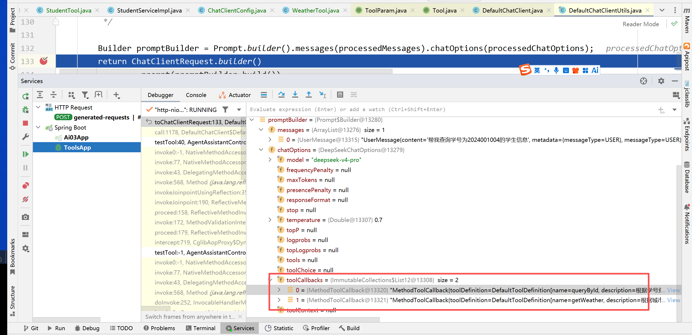

toolCallBack举例:

```plain
MethodToolCallback{toolDefinition=DefaultToolDefinition[name=queryById, description=根据学号查询一个学生, inputSchema={
  "$schema" : "https://json-schema.org/draft/2020-12/schema",
  "type" : "object",
  "properties" : {
    "arg0" : {
      "type" : "string",
      "description" : "学号"
    }
  },
  "required" : [ "arg0" ],
  "additionalProperties" : false
}], toolMetadata=DefaultToolMetadata[returnDirect=false]}
```

大模型返回结果举例:

```json
{
  "metadata" : {
    "empty" : false,
    "id" : "86fe9ac8-b3d4-402a-9b45-36f2ca141acd",
    "model" : "deepseek-v4-pro",
    "promptMetadata" : [ ],
    "rateLimit" : {
      "requestsLimit" : 0,
      "requestsRemaining" : 0,
      "requestsReset" : "PT0S",
      "tokensLimit" : 0,
      "tokensRemaining" : 0,
      "tokensReset" : "PT0S"
    },
    "usage" : {
      "promptTokens" : 393,
      "completionTokens" : 61,
      "totalTokens" : 454,
      "nativeUsage" : {
        "completion_tokens" : 61,
        "prompt_tokens" : 393,
        "total_tokens" : 454,
        "prompt_tokens_details" : {
          "cached_tokens" : 0
        }
      }
    }
  },
  "result" : {
    "metadata" : {
      "contentFilters" : [ ],
      "empty" : true,
      "finishReason" : "TOOL_CALLS"
    },
    "output" : {
      "media" : [ ],
      "messageType" : "ASSISTANT",
      "metadata" : {
        "finishReason" : "TOOL_CALLS",
        "index" : 0,
        "role" : "ASSISTANT",
        "id" : "86fe9ac8-b3d4-402a-9b45-36f2ca141acd",
        "messageType" : "ASSISTANT"
      },
      "prefix" : null,
      "reasoningContent" : "用户想知道北京的天气。我需要使用getWeather函数，参数是\"北京\"。",
      "text" : "",
      "toolCalls" : [ {
        "id" : "call_00_KdTXV822Vuwa2JzyeGul8923",
        "type" : "function",
        "name" : "getWeather",
        "arguments" : "{\"arg0\": \"北京\"}"
      } ]
    }
  },
  "results" : [ {
    "metadata" : {
      "contentFilters" : [ ],
      "empty" : true,
      "finishReason" : "TOOL_CALLS"
    },
    "output" : {
      "media" : [ ],
      "messageType" : "ASSISTANT",
      "metadata" : {
        "finishReason" : "TOOL_CALLS",
        "index" : 0,
        "role" : "ASSISTANT",
        "id" : "86fe9ac8-b3d4-402a-9b45-36f2ca141acd",
        "messageType" : "ASSISTANT"
      },
      "prefix" : null,
      "reasoningContent" : "用户想知道北京的天气。我需要使用getWeather函数，参数是\"北京\"。",
      "text" : "",
      "toolCalls" : [ {
        "id" : "call_00_KdTXV822Vuwa2JzyeGul8923",
        "type" : "function",
        "name" : "getWeather",
        "arguments" : "{\"arg0\": \"北京\"}"
      } ]
    }
  } ]
}
```

### rag

#### 概念

Retrieval-Augmented Generation，检索增强生成。

先从外部知识库（如文档、数据库）中检索相关信息，再基于检索结果结合模型已有能力生成回答。不是训练。实现如dify/阿里云百炼平台

#### 工作流程

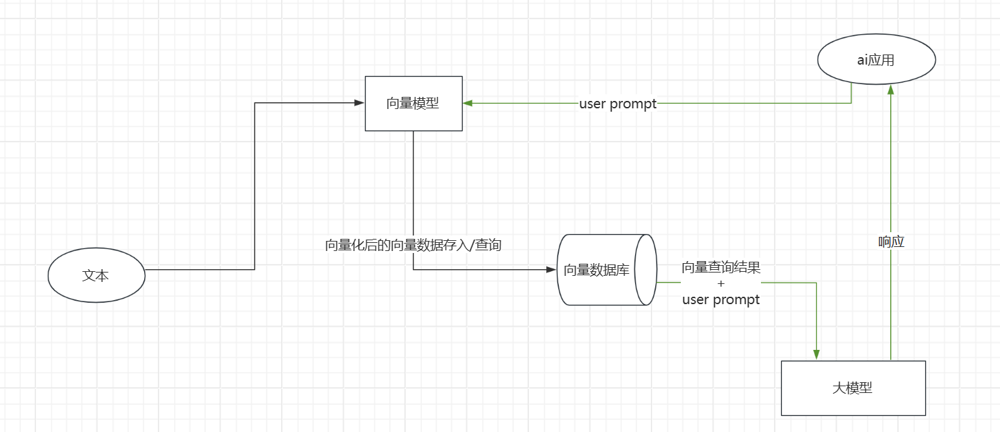

#### 应用场景

* 基于自建知识库的智能客服/智能问答

  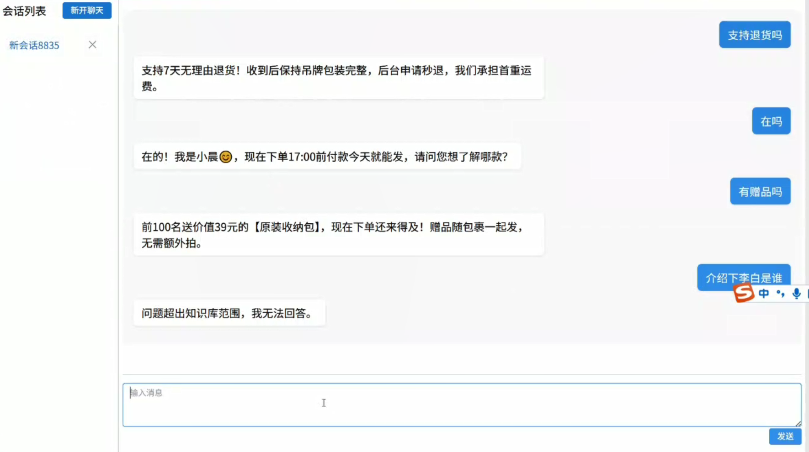

#### etl

##### Extract:抽取

对应DocumentReader接口,实现如:

* TextReader
* MarkdownDocumentReader
* PagePdfDocumentReader
* JsonReader
* JsoupDocumentReader
* tika(通用读取器)

##### Transform:文档分块

对应DocumentTransformer接口,实现如:

* TokenTextSplitter:分隔文档为多个块
* KeywordMetadataEnricher:关键字提取
* SummaryMetadataEnricher:摘要提取

##### Load:加载

在spring  ai中指的是写入向量数据库，对应DocumentWriter接口,实现如:

* VectorStore
* SimpleVectorStore
* QdrantVectorStore

#### QuestionAnswerAdvisor

#### RetrievalAugmentationAdvisor

#### 基于重排序的rag系统

### 文档向量化

#### 向量

* 每个特征表示为向量的一个维度，这样就可以通过n维向量来表示物体的特征。
* 选取的特征越多，描述越准确

* 若向量越相似，则越相近，向量是否相似涉及到的算法如余弦相似度或欧几里得距离。
* 把词语/段落转为向量,其实就是float[]

#### EmbeddingModel向量模型

用于生成向量的模型

#### 常用向量数据库

##### milvus vector store

##### SimpleVectorStore

spring ai用java实现的,教学版

##### redis vector store

##### qdrant

#### qdrant安装与介绍

* 启动服务

  ```shell
  # 拉取镜像
  docker pull qdrant/qdrant:v1.16
  mkdir /root/qdrant 
  # 6333为控制台访问端口
  # 6334为服务端口
  docker run -p 6333:6333 -p 6334:6334 --name qdrant6334 \
  -v /root/qdrant:/qdrant/storage \
  -d qdrant/qdrant:v1.16
  ```

* 访问控制台

  http://ip:6333/dashboard

* 创建collection

  ```shell
  // qdrant中的collection相当于一个表,table1是你自己起的名字
  PUT collections/table1
  {
    "vectors":{
    	// 文字向量维数多少,1024,1536,2048
    	"size": 4,
    	// 计算向量相似度的方式
    	"distance": "Cosine"
    }	
  }
  // List all collections
  GET collections
  // 查询指定collection的配置信息
  GET collections/table1
  // 手动添加数据
  PUT collections/table1/points
  {
    "points": [
      {
        "id": 1,
        "vector": [0.05, 0.61, 0.76, 0.74],
        "payload": {
          "colony": "Mars"
        }
      },
      {
        "id": 2,
        "vector": [0.19, 0.81, 0.75, 0.11],
        "payload": {
          "colony": "Jupiter"
        }
      },
      {
        "id": 3,
        "vector": [0.36, 0.55, 0.47, 0.94],
        "payload": {
          "colony": "Venus"
        }
      },
      {
        "id": 4,
        "vector": [0.18, 0.01, 0.85, 0.80],
        "payload": {
          "colony": "Moon"
        }
      },
      {
        "id": 5,
        "vector": [0.24, 0.18, 0.22, 0.44],
        "payload": {
          "colony": "Pluto"
        }
      }
    ]
  }
  // 相似搜索
  POST collections/table1/points/search
  {
    "vector": [0.2, 0.1, 0.9, 0.7],
    "limit": 3,
    "with_payload": true
  }
  // 查询单条文档
  GET collections/table1/points/文档id
  // 条件查询文档
  POST collections/table1/points/scroll
  {
    "limit": 10,
    "filter": {
      "must": [
        {
          "key": "city",
          "match": {
            "any": [
              "San Francisco",
              "New York",
              "Berlin"
            ]
          }
        }
      ]
    }
  }
  // 删除
  DELETE collections/table1
  ```

### RerankModel

#### 为什么要有?

* 向量相似度的局限性

  向量db基于余弦相似度等数学函数进行计算,不一定准确

* 排序质量不好

  尤其一些性能差的向量模型因为计算出来的向量维度较小,则更为明显

* 上下文理解缺失

  完全依赖向量db和向量模型缺乏对文档上下文的理解

#### rerank类模型为什么可以提升精度?

* 二阶段排序

  * 粗排:从向量db中检索出n(较大)个文档
  * 精排:交给重排模型进行精排

* 专门的重排序模型

  重排序模型对文档相关性做专门的训练

### mcp

官网: https://modelcontextprotocol.io/

#### 作用

model  context  protocol:模型上下文协议,即大模型之间的调用协议，json-rpc。解决调用外部tools的问题，应用自身或第三方把tools(比如订单查询，查询天气，规划路线)抽取为单独的服务，比如高德可提供mcp服务,这些服务只与ai应用进行交互。

使用json-rpc协议进行传输,如:

请求（Request）

```json
{
  "jsonrpc": "2.0",      // 协议版本
  "method": "add",       // 要调用的方法名
  "params": [1, 2],      // 参数（数组或对象）
  "id": 1                // 请求标识，用于匹配响应
}
```

响应（Response）

```json
{
  "jsonrpc": "2.0",
  "result": 3,           // 成功时返回结果
  "id": 1                // 与请求 id 对应
}
```

#### 原理

与tools一致

#### mcp client

公共的工具可以在  https://mcp.so/ 上进行查找

也可自己开发,如基于spring ai进行开发。

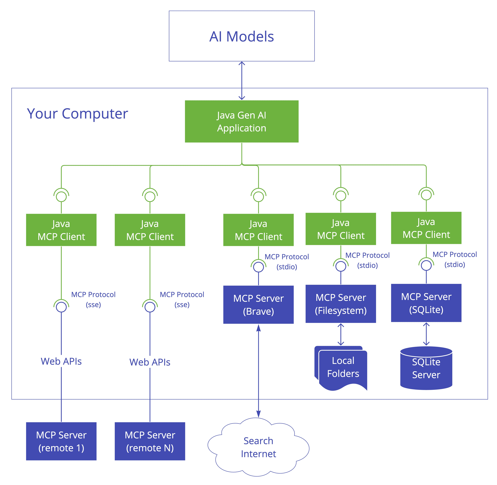

#### mcp server

公共的可以在  https://mcp.so/ 上进行查找,如amap,baidu map,也可自己开发,如基于spring ai进行开发。

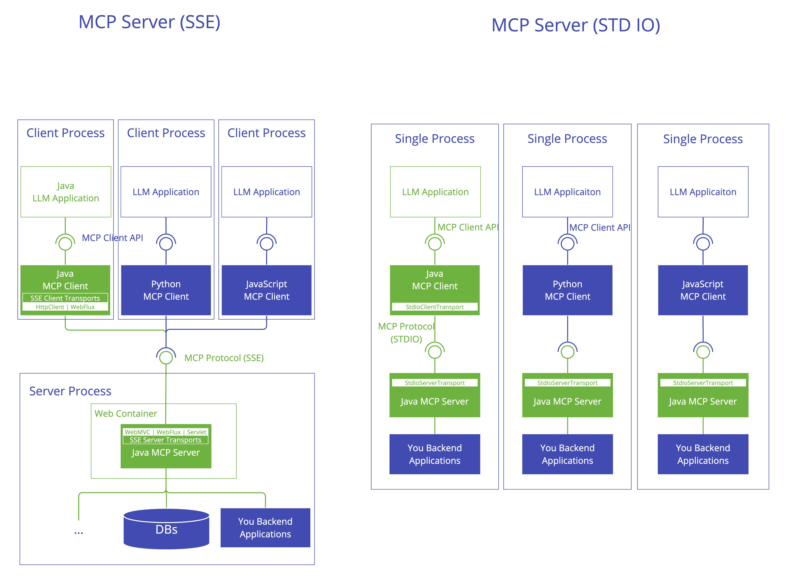

mcp协议按传输方式的不同可以分为三种

##### stdio

###### 简介

标准输入输出。使用场景一般是客户端(vs code、cursor等)

stdio类型的mcp server可以是python程序,nodejs程序，java的jar包都可以，客户端会通过子进程启动这个拉到本地的程序，所以本地需要有对应语言的环境。

###### 自定义client+公共的server

公共的server,步骤如下:

* 安装 npm i -g  @amap/amap-maps-mcp-server 即可

  安装的包内部也是定义了一个个的tools，然后作为上下文发送给大模型（参考tools原理）

基于spring ai开发mcp client,步骤如下:

* 引入依赖

* 配置application.yml

* stdio-server-config.json

* 通过注入ToolCallbackProvider绑定到chatClient

* 打开日志观察

  启动日志:

  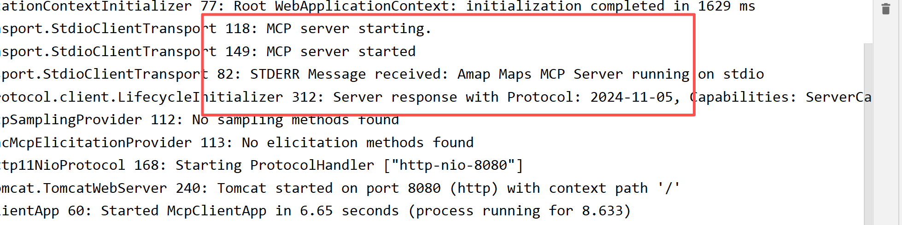

  工具截图:

  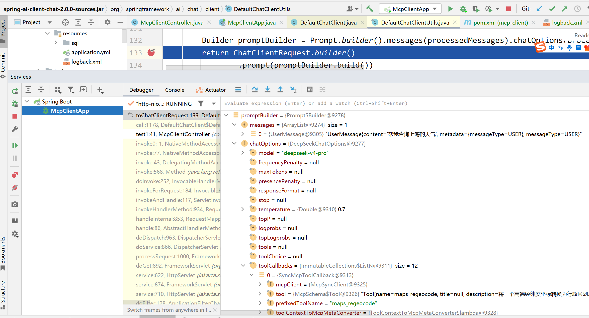

###### 自定义client+自定义server

spring ai开发mcp stdio server

spring ai client端的步骤如同上

##### sse

###### 简介

适用于web,单独在外部启动的一个服务

###### 自定义client+自定义server

spring ai开发mcp sse server

spring ai client端的步骤如下:

* 引入依赖

* 配置application.yml

* 通过注入ToolCallbackProvider绑定到chatClient

* 打开日志观察

##### streamable http

###### 简介

用于替代sse

###### 自定义client+自定义server

spring ai开发mcp streamable http server

spring ai client端的步骤如下:

* 引入依赖

* 配置application.yml

* 通过注入ToolCallbackProvider绑定到chatClient

* 打开日志观察